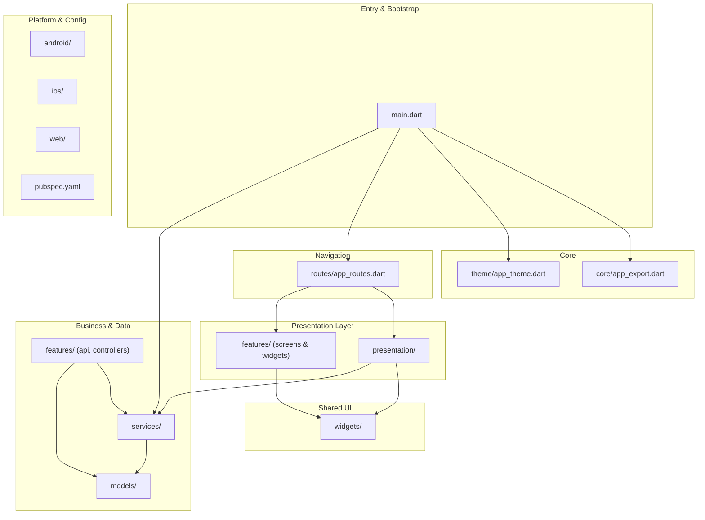
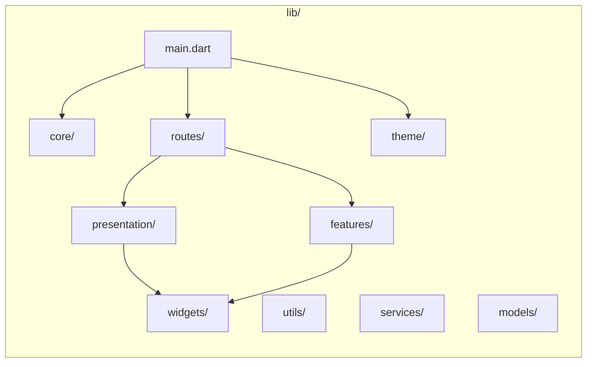
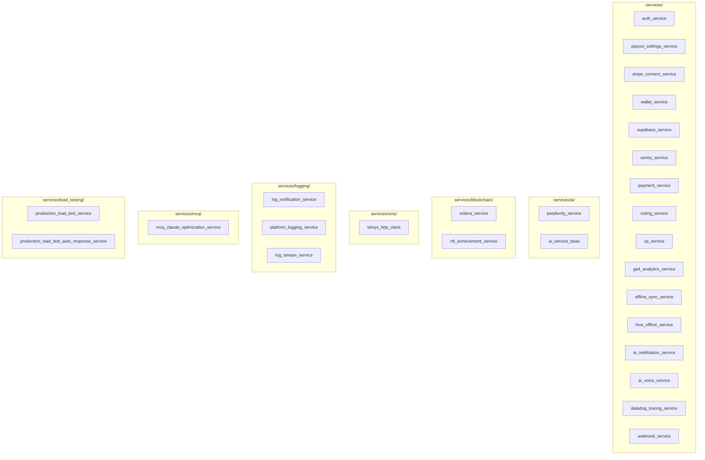
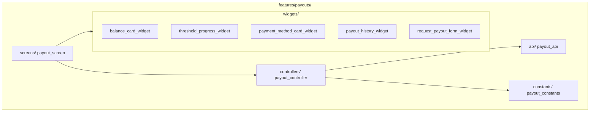
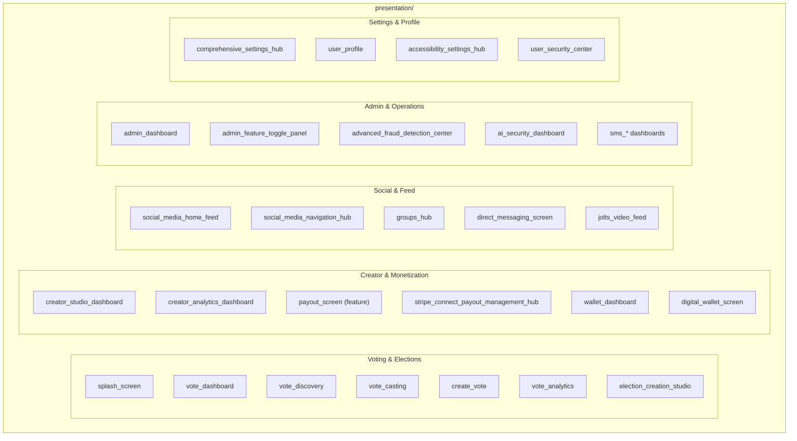
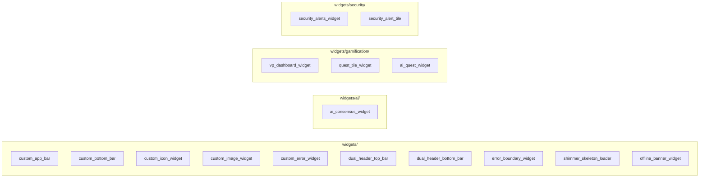
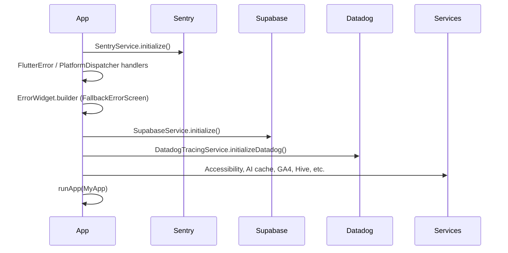

# Vottery Mobile App — Codebase Architecture Diagram

Flutter/Dart mobile app (vottery M). High-level structure and relationships.

---

## 1. High-level layer diagram

---

## 2. lib/ folder structure

---

## 3. Services layer (detail)

---

## 4. Features module (payouts example)

---

## 5. Presentation layer (screen categories)

---

## 6. Shared widgets

---

## 7. Main.dart initialization flow

---

## 8. External dependencies (from pubspec)

| Category        | Examples                                      |
|----------------|-----------------------------------------------|
| Backend        | `supabase_flutter`, `dio`, `http`             |
| Auth & security| `local_auth`, `passkeys`, `google_sign_in`     |
| Payments       | `flutter_stripe`                              |
| Analytics      | `sentry_flutter`, GA4, Datadog (via services)  |
| UI & layout    | `sizer`, `flutter_svg`, `google_fonts`        |
| Media          | `video_player`, `camera`, `image_picker`      |
| Maps & location| `geolocator`, `google_maps_flutter`           |
| State & routing| `provider`, `go_router`                       |
| Blockchain     | `web3dart`                                    |

---

## Summary

| Layer        | Location        | Role                                      |
|-------------|-----------------|-------------------------------------------|
| Entry       | `main.dart`     | Bootstrap, Sentry, Supabase, Datadog, runApp |
| Core        | `core/`, `theme/` | Exports, theme                            |
| Navigation  | `routes/`       | Route map → presentation & feature screens |
| Screens     | `presentation/`, `features/*/screens/` | Full-page UIs        |
| Shared UI   | `widgets/`      | App bar, bottom bar, error, loading, etc. |
| Business    | `services/`, `features/*/api|controllers` | Auth, payouts, wallet, AI, SMS, etc. |
| Data        | `models/`       | Domain / API models                       |
| Config      | `pubspec.yaml`, `android/`, `ios/`, `web/` | Deps and platform  |

Render the Mermaid blocks in any Markdown viewer that supports Mermaid (e.g. GitHub, VS Code with Mermaid extension, or [mermaid.live](https://mermaid.live)).
